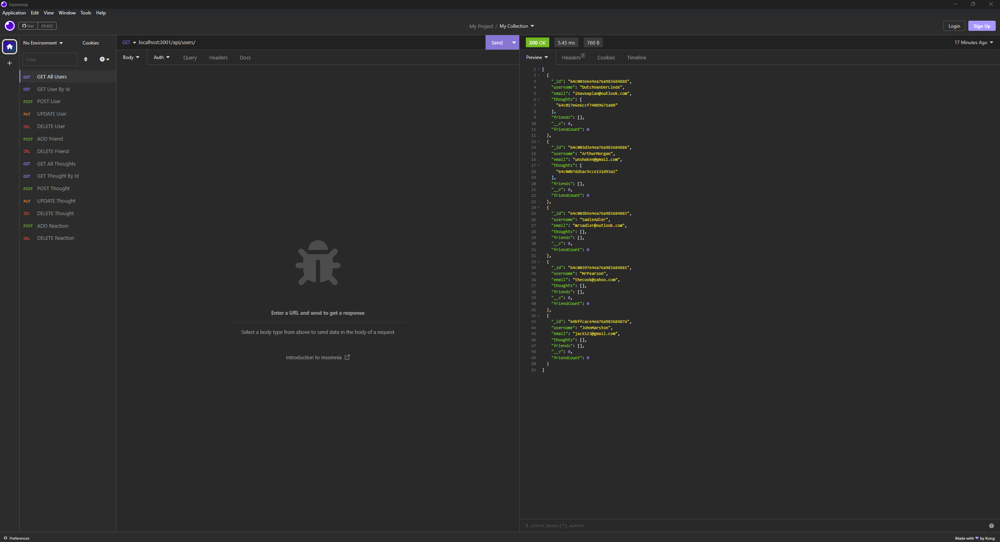
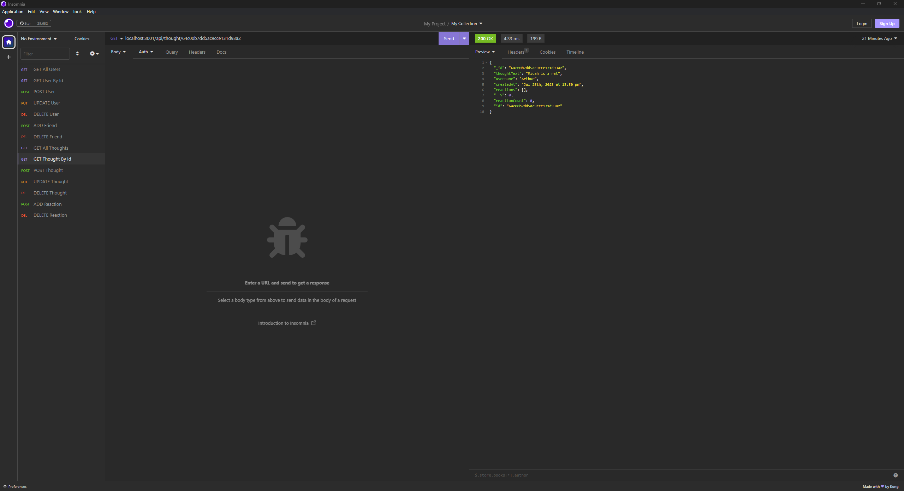
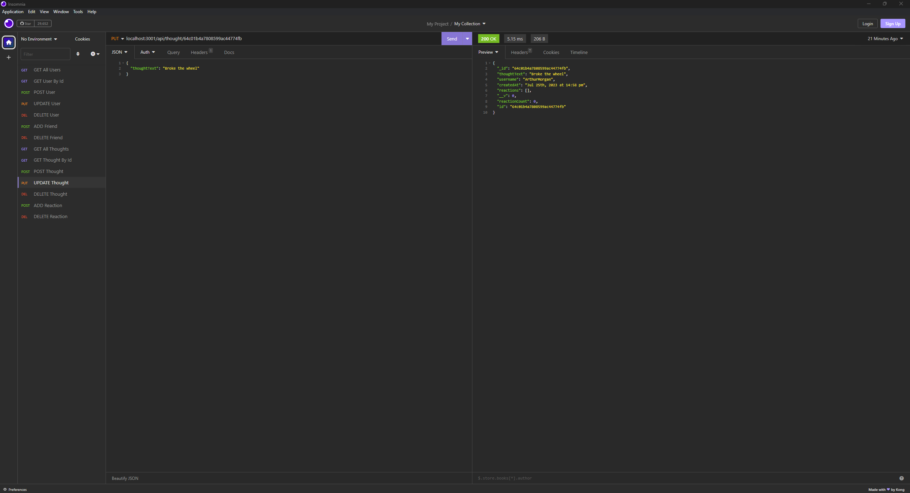
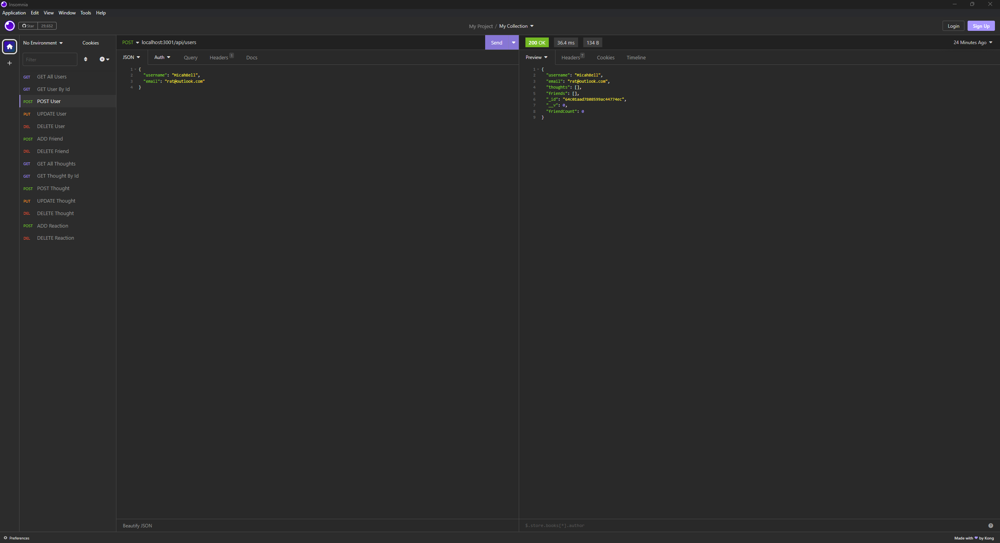
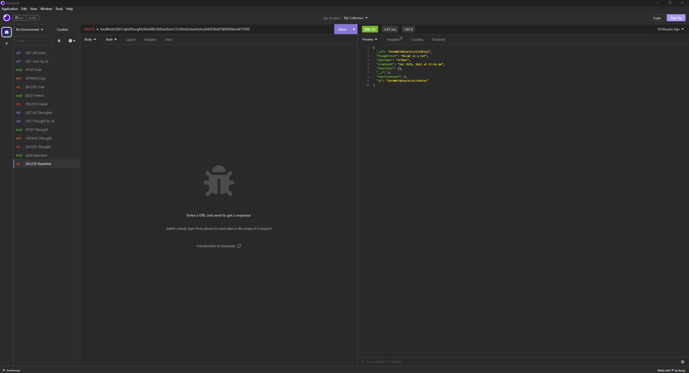

# NoSQL Social Network API

[](https://opensource.org/licenses/MIT)

## Description
This application is an API which can be used by a social network web application to allow users to create a friend list, share their thoughts, and react to their friends thoughts. This app would be perfect for any social media company. It uses a NoSQL database, [MongoDB](https://www.mongodb.com/) as the database, [Express.js](https://expressjs.com/) for routing, and [Mongoose ODM](https://mongoosejs.com/docs/index.html) to handle large amount of unstructured data.

[Insomnia](https://insomnia.rest/download) is used for testing routes and viewing the output of the routes. GET routes for users and thoughts are used to show data that is displayed in JSON format. POST, PUT, and DELETE routes are used in order to create, update, and delete users, thoughts, friends, and reactions in the database. 

## Table of Contents
- [Installation](#installation)
- [Usage](#usage)
- [Mockup](#mockup)
- [Contributing](#contributing)
- [GitHub](#github)
- [Email](#email)
- [Instructions](#instructions)
- [Walkthrough Video](#walkthrough-video)

## Installation
The user should clone the repository, navigate to the folder in the CLI, and run ```npm install``` to install Node.js. 

## Usage
This application is meant to be used by social media companies in order to allow users to use their app.

## Mockup







## Contributing
Please email me to discuss contributing.

## GitHub
GitHub: https://github.com/caitlinramsey/nosql-social-network-api

## Email
Email: caitlinramsey@outlook.com

## Instructions 
Run the API and test the routes in Insomnia.
## Walkthrough Video
Video: <a href="https://drive.google.com/file/d/1pmXW9JSMOJvMzrbyowFjigPX7puGw03f/view" target="_blank">Click Here</a> to view the walkthrough video.